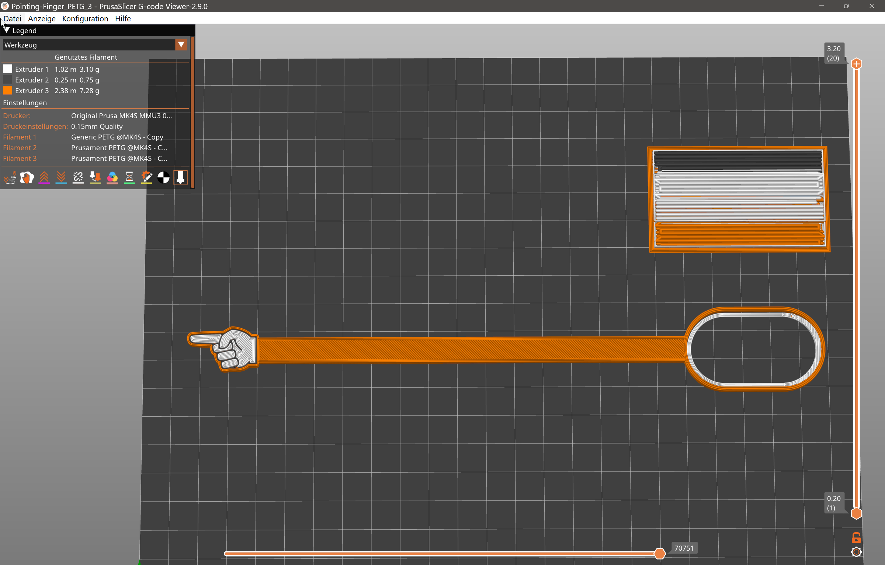
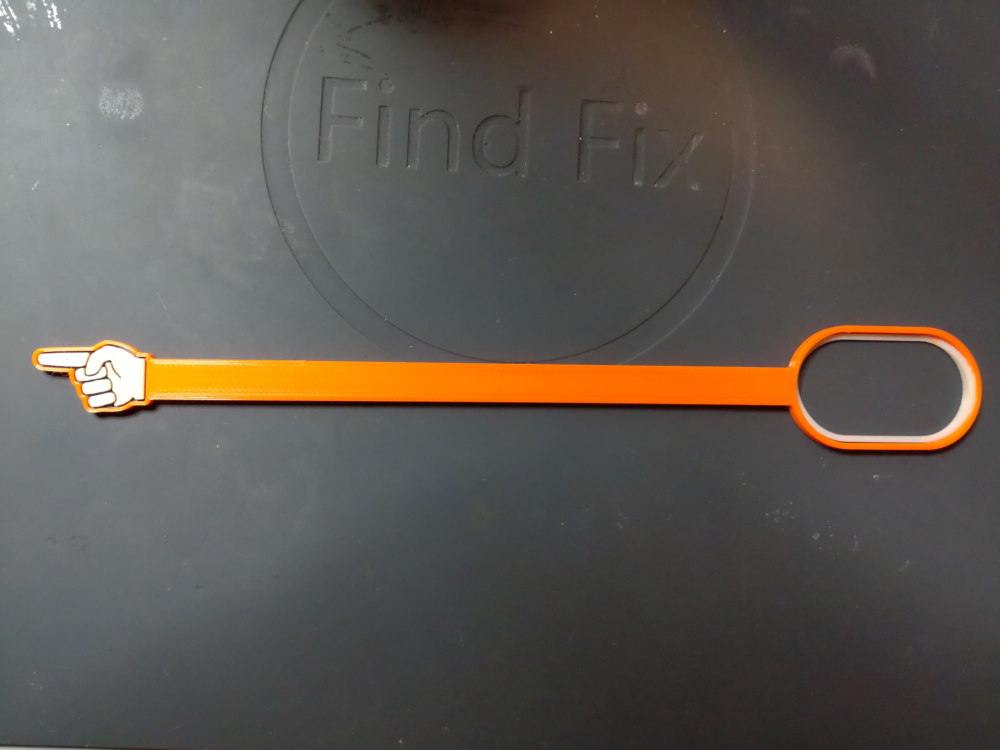
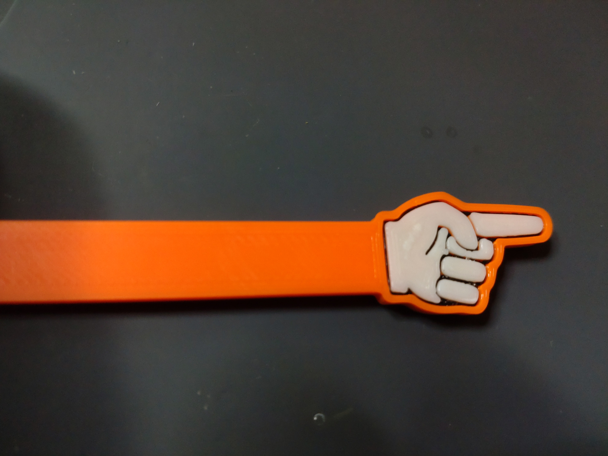
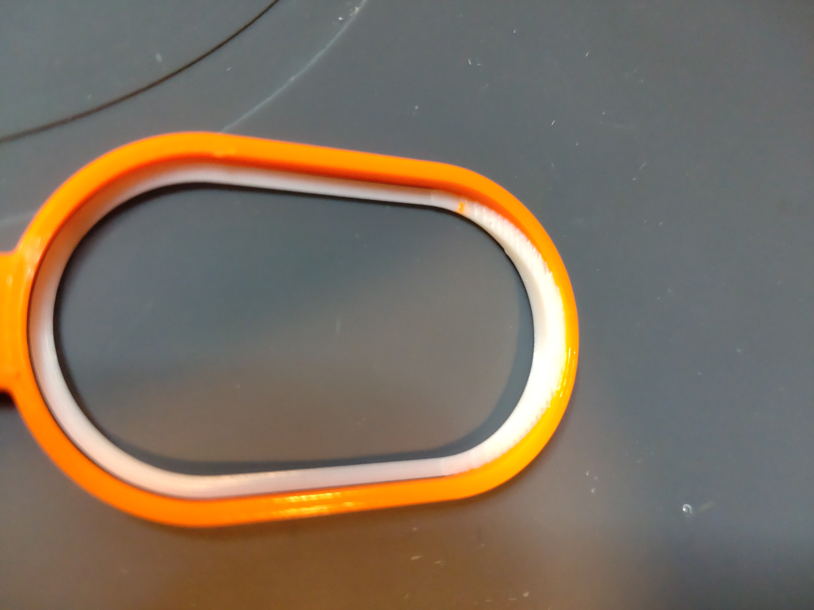

# Pointing-Finger-Stick
3D printable Pointing Finger Stick. Created with Rhino 8.

The guy with the swiss accent on youtube often uses a selfmade pointing-finger-stick to point out details in his videos.
I found this very usefull because i often take pictures when repairing electronic or makeing DIY IoT projects.
So i designed this 3D printable one. I can use is as pointing finger or frame something with the other end. 
It can also be used as a bookmark in books. The inner white ring is flexible and can be clamped to a page.
I printed in 3 colors.

Requirements:
* 3D printer 
* Filament of your choice (i used PETG)

## View

 

 

 
